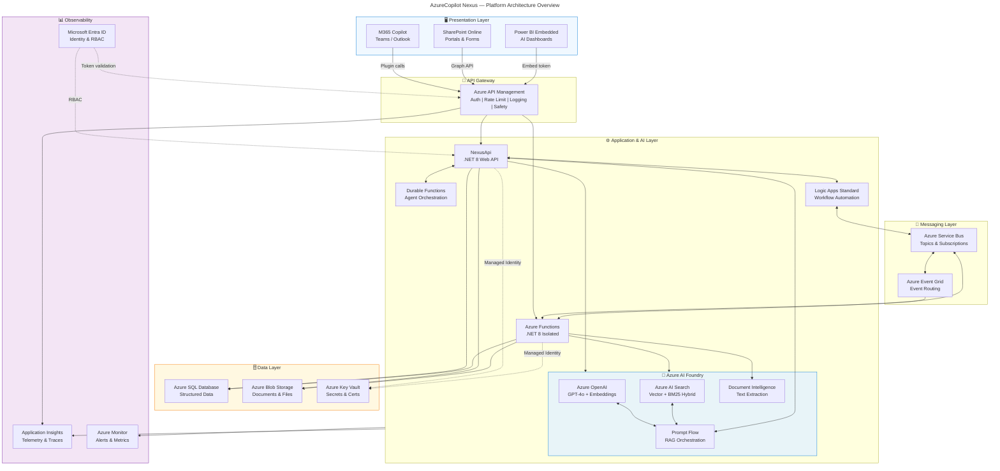

# AzureCopilot Nexus Platform
## Enterprise AI-Native E2E Platform — MVP
---


## Platform Vision

**AzureCopilot Nexus** is an enterprise-grade, AI-native, end-to-end platform built on the Microsoft Azure and Microsoft 365 ecosystem. It unifies AI-powered workflows, intelligent automation, conversational interfaces, and enterprise data access into a single governed platform — accelerating decision-making, reducing manual overhead, and enabling scalable AI adoption across the organization.

The platform is designed as a **composable, cloud-first system** that integrates:
- **Microsoft 365 Copilot** as the primary AI interaction layer
- **Azure AI Foundry / Azure AI Studio** as the AI model and RAG orchestration backbone
- **Azure cloud services** for compute, messaging, storage, and integration
- **SharePoint Online** for enterprise content management and workflow initiation
- **C#/.NET APIs** as the enterprise service and integration tier
- **Azure SQL Database** as the authoritative structured data layer


## Solution

AzureCopilot Nexus delivers a **unified AI platform** that:

| Capability | Description | Value |
|---|---|---|
| AI Dashboards | Real-time, AI-narrated insights from SQL + SharePoint + APIs | Faster decisions |
| AI Workflows | Intelligent routing, classification, and approvals via Logic Apps + Copilot | 60–80% reduction in manual steps |
| Conversational Interface | Copilot plugin-powered chat grounded in enterprise knowledge | Self-service information access |
| Automated Agents | Durable Function agents that autonomously execute multi-step tasks | 24/7 operational automation |
| Enterprise Integrations | APIM-governed connections to SAP, Dynamics, legacy systems | Single pane of glass |
| Governed AI | Entra ID RBAC, content filtering, audit logging, prompt safety | Compliant AI deployment |

---

## Key Platform Principles

- **AI-First:** Every module is designed to be augmented by AI from day one, not retrofitted.
- **Composable:** Modules are independently deployable and loosely coupled via Azure Service Bus and APIM.
- **Governed:** All AI calls are proxied through APIM with logging, rate limiting, and content safety enabled.
- **Secure by Default:** Zero-trust architecture, Managed Identity throughout, no secrets in code.
- **Observable:** Full telemetry stack via Application Insights + Azure Monitor + AI evaluation pipelines.

---

## Technology Stack Summary

```
Microsoft 365 Copilot        → Conversational AI interface layer
Azure OpenAI (GPT-4o)        → Language model backbone
Azure AI Search              → Vector search and RAG retrieval
Azure AI Foundry             → Model management and evaluation
Azure Functions (.NET 8)     → Serverless compute and agents
Azure Logic Apps             → Workflow automation
Azure API Management (APIM)  → API gateway and governance
Azure Service Bus            → Event-driven messaging
Azure SQL Database           → Structured data persistence
Azure Storage (Blob + Queue) → Document storage and async queuing
SharePoint Online            → Content management and workflow trigger
Microsoft Entra ID           → Identity, RBAC, and zero-trust
Application Insights         → Telemetry and observability
GitHub Actions               → CI/CD automation
Bicep                        → Infrastructure as Code
```

## Architecture Diagrams



