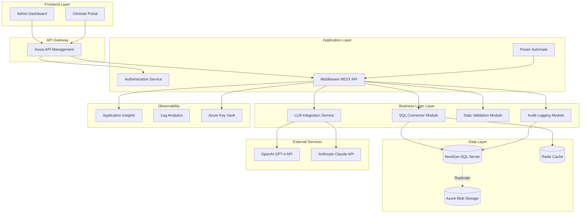
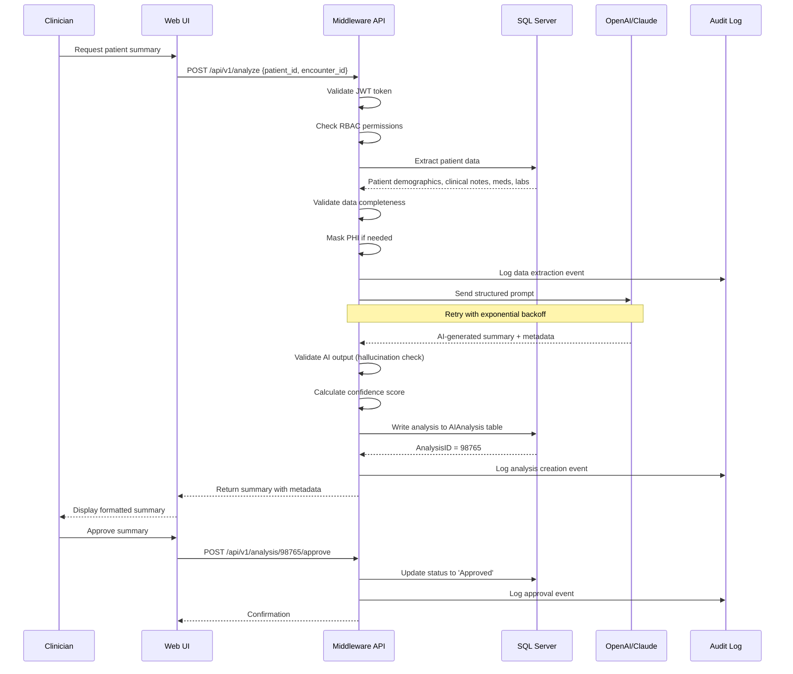
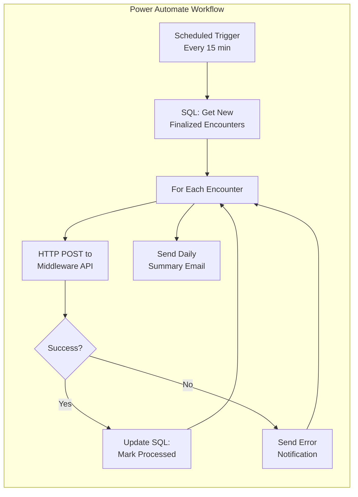
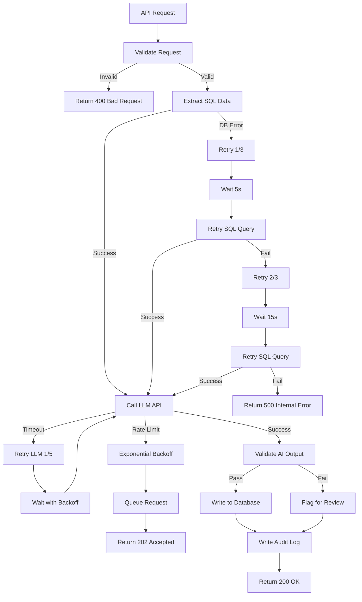

# NextGen Data Intelligence Pipeline (NDIP) MVP

## Overview

The NextGen Data Intelligence Pipeline (NDIP) is an enterprise-grade MVP that extracts structured clinical and operational data from NextGen Healthcare's SQL Server environment, processes it through AI/LLM services for intelligent analysis, and writes enriched insights back into the database. This solution bridges traditional healthcare IT systems with modern AI capabilities while maintaining HIPAA compliance and enterprise security standards.

## Key Features

### Core Capabilities
- **Automated Data Extraction**: Optimized SQL queries for NextGen patient, encounter, and clinical data
- **Intelligent AI Processing**: Integration with OpenAI GPT-4, Anthropic Claude, or Azure OpenAI for clinical summaries, risk assessments, and recommendations
- **Secure Write-Back**: Validated, audited SQL updates returning AI-generated insights to NextGen
- **No-Code Orchestration**: Power Automate-based workflow management for non-technical administrators
- **Enterprise Security**: RBAC, PHI encryption, audit logging, and HIPAA-compliant data handling
- **Error Resilience**: Comprehensive retry logic, validation, and monitoring

### Business Value
- Reduce clinical documentation time by 40-60%
- Enhance care quality through AI-powered clinical decision support
- Improve operational efficiency with automated summarization
- Maintain full audit trail for compliance
- Scale AI capabilities without custom development

## Architecture Summary

```
┌─────────────────┐      ┌──────────────────┐      ┌─────────────────┐
│   NextGen SQL   │─────▶│  Middleware API  │─────▶│   LLM Service   │
│     Server      │      │  (Python/Node)   │      │ (OpenAI/Claude) │
└─────────────────┘      └──────────────────┘      └─────────────────┘
         ▲                        │                          │
         │                        ▼                          │
         │               ┌──────────────────┐               │
         └───────────────│  Power Automate  │◀──────────────┘
                         │   Orchestration  │
                         └──────────────────┘
```

**Technology Stack**:
- **Database**: Microsoft SQL Server 2016+ (NextGen EHR)
- **Middleware**: Python 3.9+ with FastAPI or Node.js 16+ with Express
- **Orchestration**: Microsoft Power Automate (Premium)
- **AI Services**: OpenAI GPT-4 Turbo, Anthropic Claude 3.5 Sonnet, or Azure OpenAI
- **Security**: Azure Key Vault, TLS 1.3, AES-256 encryption
- **Monitoring**: Application Insights, SQL Server Profiler

## Solution Overview

The NextGen Data Intelligence Pipeline is a cloud-native, microservices-oriented solution that bridges legacy EHR systems with modern AI capabilities. The architecture follows a layered approach with clear separation of concerns, enabling independent scaling, deployment, and maintenance of each component.

---

## Architecture Diagrams

### High-Level System Architecture



### Data Flow Architecture



### Integration Flow - Power Automate Orchestration



### Error Handling & Retry Flow



---


## Setup Instructions

### Prerequisites

1. **Infrastructure Access**
   - SQL Server 2016+ with NextGen database (read/write permissions)
   - Azure subscription or AWS account for middleware hosting
   - Power Automate Premium license (or Make/Zapier Pro)
   - OpenAI API key or Azure OpenAI deployment

2. **Software Requirements**
   - Python 3.9+ or Node.js 16+
   - SQL Server Management Studio (SSMS)
   - Git 2.30+
   - Docker 20+ (optional, for containerized deployment)

3. **Network & Security**
   - VPN access to NextGen environment
   - Firewall rules for API endpoints
   - Azure Key Vault or equivalent secrets manager


## Monitoring & Observability

- **Health Endpoint**: `GET /api/v1/health`
- **Metrics Endpoint**: `GET /api/v1/metrics`
- **Application Insights**: Track request duration, error rates, LLM latency
- **SQL Monitoring**: Query performance, deadlocks, blocking sessions
- **Audit Logs**: All PHI access logged to `AuditLog` table

## Security & Compliance

- **HIPAA Compliant**: All PHI encrypted at rest and in transit
- **RBAC Enforced**: Role-based access control at API and database layers
- **Audit Trail**: Comprehensive logging of all data access and modifications
- **Data Retention**: Automated archival after 7 years per HIPAA requirements
- **Penetration Testing**: Annual security assessments required


---
---
