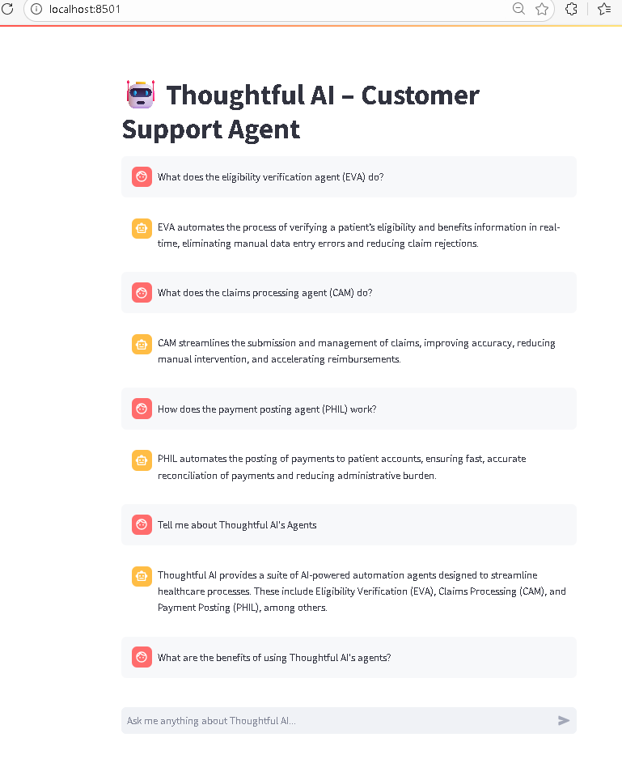
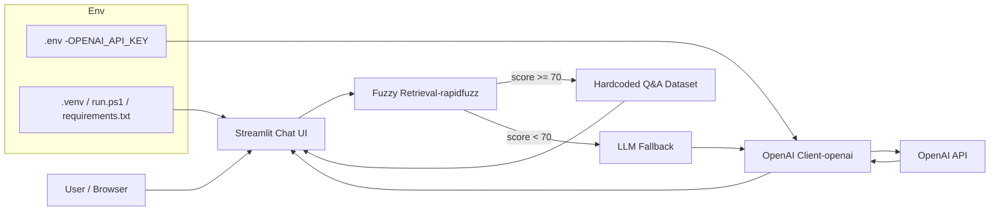

# Thoughtful AI – Customer Support Agent

This project implements a lightweight customer‑support AI Agent for answering common questions about **Thoughtful AI’s automation agents**.  
It uses:

- A **hardcoded Q&A dataset** for known questions  
- A **simple retrieval layer** (fuzzy matching)  
- A **fallback LLM response** for all other queries  
- A clean **Streamlit chat UI**

---

## 🚀 Features

- Conversational chat interface  
- Hardcoded knowledge base for Thoughtful AI  
- Fuzzy matching to find the closest predefined answer  
- Graceful fallback to an LLM (OpenAI, Anthropic, or any provider)  
- Error handling for unexpected inputs  
- Fully contained in a single Python file

 

---

## Architecture

Notes:
- The app first attempts a local retrieval from the hardcoded dataset. If no confident match is found (threshold: 70), it falls back to the LLM.
- Secrets (API keys) are loaded from `.env`. The `run.ps1` script installs pinned dependencies from `requirements.txt` into the `.venv` and launches Streamlit.

---
**Built with AI**

Last Updated: February 17, 2026

---

